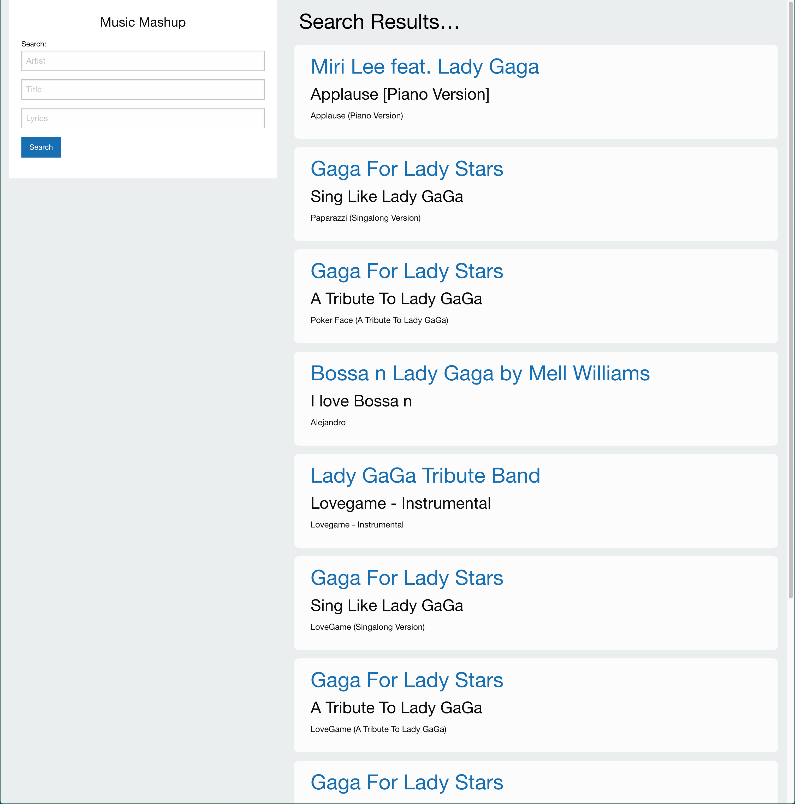
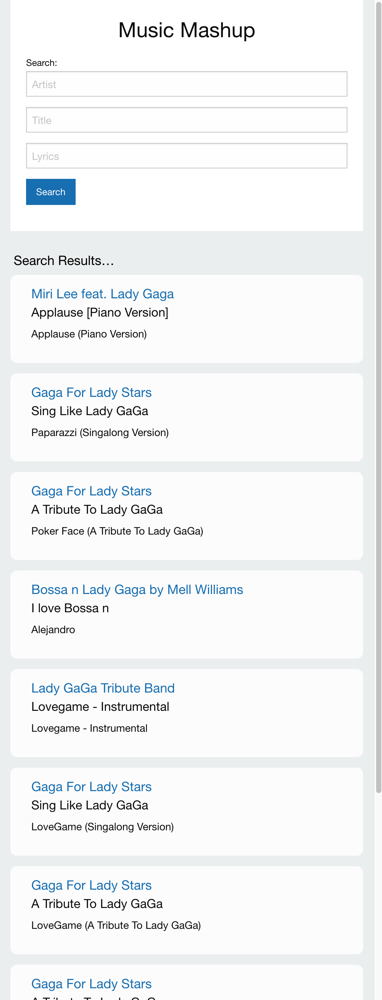

# music-mashup
A web application that allows a user to search a song by name & artist and displays lyrics & video content. This app runs in the browser and features dynamically updated HTML and CSS powered by JavaScript. It uses MusixMatch and Youtube API to retrieve song and video data.

Here is the link to the deployed application: [Music Mashup] (https://icvalle.github.io/music-mashup/)

The following images show the web application’s appearance.

  

## Contributors

  

## License

